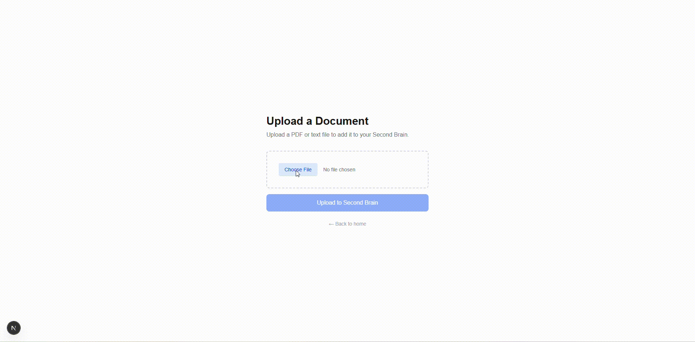

# Second Brain

This is a full-stack AI powered knowledge base that lets the user upload documents and asks questions about them in plain English. Second Brain was build with a RAG (Retrieval-Augmented Generation) pipeline using LlamaIndex, ChromaDB, and Claude.

# Demo

# Ingest Pipeline
1. User uploads PDF or text file
2. Fast API receives file and passes it to ingest pipeline
3. Llamaindex parses and chunks the doc
4. Each chunk is embedded locally using HuggingFace model
5. Vectors are stored in ChromaDB

# Query Pipeline
1. User types a question in the chat interface
2. FastAPI receives the question and embeds it using the same model
3. ChromaDB searches for the most relevant chunks
4. Retrieved chunks are passed to Claude as Context
5. Claude Synthesizes an answer and returns it to frontend

# Tech Stack
## Backend
+ <u>FastAPI</u> - Python web framework for the REST API
+ <u>LlamaIndex</u> - RAG Framework for document ingestion and retrieval
+ <u>ChromaDB</u> - local vector database for storing embeddings
+ <u>Hugging Face 'all-MiniLM-L6-v2'</u> - local embedding model 
+ <u>Claude - Anthropic</u> - Large Language Model (LLM) for answer synthesis

## Frontend
+ <u>Next.js</u> - React framework with App Router
+ <u>TypeScript</u> - type-safe Javascript
+ <u>Tailwind CSS</u> - styling

